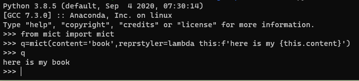

## `mict` -- middle-ground between `dict` and a `class`

[](https://mybinder.org/v2/gh/jerzydziewierz/mict/HEAD?filepath=demo.ipynb)

Provides `MATLAB`-struct-like dot notation for setting and of items in a `dict` (dictionary), and a handful of interactivity tools.

`mict` is intended to be a middle ground between `dict` and full fledged `class` / `object` pattern for structured data storage.

It does a bit more than basic `dict`, but does not attempt to supersede pandas, numpy nor other advanced data storage tools


[TOC]


## Installation

Try installing with `pip`, grabbing it straight from `github`:
    
```bash
python -m pip install -U git+https://github.com/jerzydziewierz/mict.git#egg=mict
```


>  Note: the `#egg=commontools` provides better compatibility in case if you want to use `mict` in your own package as a dependency.


To uninstall, the symmetric command is:

```bash
python -m pip uninstall mict
```


Otherwise, for a development mode editable local installation, try cloning the files from the repo to your favourite folder, and then try, from inside the root folder of the repo (where the `setup.py` is )

```bash
python -m pip -e .
```


This package intends to use [PEP 517](https://www.python.org/dev/peps/pep-0517)  and it's implementation, [setuptools Quickstart — setuptools 54.2.0 documentation](https://setuptools.readthedocs.io/en/latest/userguide/quickstart.html)

## Demo

Online demo with binder: 

[](https://mybinder.org/v2/gh/jerzydziewierz/mict/HEAD?filepath=demo.ipynb)

local demo: please see `demo.ipynb` -- a jupyter notebook.


## Basic usage

Always remember that `mict` inherits from `dict` and hence, all the operations that are valid for `dict` are also valid for `mict`. On top of that, new operations are available.


```python
from mict import mict
q=mict()
q.first = 'Hello world!'
q
```


<div>
<br/><table><tr><th>key</th><th>value</th></tr><tr><td>first</td> <td> Hello world!</td> </tr>  </table></div>


---

The first power of `mict` is the ease of adding, removing, altering the contents -- and the the nice visualisation of them.

You can add new keys easily, and then access them using dot-notation:


```python
q.second = 'not'
q.third = 3
q
```


<div><br/><table><tr><th>key</th><th>value</th></tr><tr><td>first</td> <td> Hello world!</td> </tr> <tr><td>second</td> <td> not</td> </tr> <tr><td>third</td> <td> 3</td> </tr>  </table></div>


---

The visualiser function in `mict` is called `reprstyler`.

A new `mict` instance comes with the `reprstyler_html` already set to `reprstyler_basic_html` but you can, and should make your own reprstylers -- see below on how to do that.


## Convenience save and load functions using pickle

> **Warning**: Since the `pickle` save/load also loads executable functions (including the `reprstyler`), all the precautions that apply to `pickle` apply here. Loading untrusted files is potentially unsafe. 


methods `(instance).to_pickle()` and `(class).from_pickle()` work as you would expect:


```python
q.to_pickle('demo.pickle')
```


    True


```python
q1=mict.from_pickle('demo.pickle')
q1
```

<div><br/><table><tr><th>key</th><th>value</th></tr><tr><td>first</td> <td> Hello world!</td> </tr> <tr><td>second</td> <td> not</td> </tr> <tr><td>third</td> <td> 3</td> </tr>  </table></div>


---
## Casting to pure `dict`

`mict` under the hood is really a `dict` with some extra handlers


```python
dict(q)
```


    {'reprstyler_html': <function mict.reprstylers_generic.reprstyler_basic_html(subject=None)>,
     'first': 'Hello world!',
     'second': 'not',
     'third': 3}


## Customizing the reprstyler 

This is the real reason why I developed `mict`, and a primary value proposition. `mict` provides a quick and simple way to customize how the contents of the dictionary are visualized:
    


```python
from mict import mict
def baldstyler(subject):
    return f'baldness score: {subject.bald:0.3f}'

q=mict(zap=None,bald=6.28,hidden_value1=45,reprstyler_html=None,reprstyler=baldstyler)

q
```


```python
baldness score: 6.280
```


---

As everything in `mict`, the reprstyler can and should be changed **after** initializing the `mict` storage itself


```python
def new_reprstyler(subject=None):
    txt = 'keys:  '
    for key in subject.keys():
        if key == 'reprstyler' or key == 'reprstyler_html':  # do not list reprstyler
            continue
        txt = f"{txt} {key}={subject[key]};"
    return txt

q.reprstyler = new_reprstyler
q
```


```python
keys:   zap=None; bald=6.28; hidden_value1=45;
```


```python
def baldstyler_html(subject):
    return f'<h4>✅high baldness score: {subject.bald:0.3f}</h4>' if subject.bald>5 else f'<h4>❌not bald enough: {subject.bald:0.3f}</h4>'
q.reprstyler_html = baldstyler_html
q
```


<div><b>✅high baldness score: 6.280</b></div>


```python
q.bald = 3.1
q
```


<div><b>❌not bald enough: 3.100</b></div>


## An even quicker way to make a reprstyler

You can use `lambda` anonymous function definition to make a reprstyler quickly.

Note that `reprstyler_html` will display any html you give it, including images, videos, sound or javascript inserts


```python
q=mict(fill='blue',r=15)
q.reprstyler_html=lambda this:f'<svg width="200" height="100" ><circle cx="50" cy="50" r="{this.r}" fill="{this.fill}" /></svg>'
q
```


<div><svg width="200" height="100" ><circle cx="50" cy="50" r="15" fill="blue" /></svg></div>


```python
q.r=32
q.fill='red'
q
```


<div><svg width="200" height="100" ><circle cx="50" cy="50" r="32" fill="red" /></svg></div>


```python
## Remove the `reprstyler` and use the default `dict` styler -- while preserving other functionality.
q.reprstyler_html=None
try:
    q.pop('reprstyler_html')
except:
    pass
```


```python
q
```


{'fill': 'red', 'r': 32}


```python

```

If you want a different styler for `jupyter`, and a different one for `console-only`, you can (optionally) override the `reprstyler` rather than `reprstyler_html`. The latter will only be used if `_repr_html_` is called -- as `jupyter` first tries to call that first; the former is the default called by the console-only `IPython`





## Other output formats

If you really feel like it, this could be extended to markdown, png, svg and other visualizers supported by `jupyter`.


You can still see the classic `dict` __repr__ function (lists all keys/values) using

```python
super(mict,q).__repr__()
```

# Advanced uses

## Show the shape of big variables, instead of their content

Much of the actual research code will use numpy arrays or long lists. These are typically unwieldy to just display as-is. 

`mict` provides a default `reprstyler`, `reprstyler_basic_html`  which has a way to only display the shape of the `numpy`/`tensorflow`/`pytorch`/`jax` array, instead of the contents. You will find that this is often what you need displayed instead of the regular dandruff.


```python
from mict import mict
import numpy
q=mict(small_array=numpy.array([1,2,3,4,5]),reprstyler_html=None) # reprstyler_html is enabled by default to `reprstyler_basic_html`.
q
```


```python
{'small_array': array([1, 2, 3, 4, 5]), 'reprstyler_html': None}
```


```python
from mict import mict
from mict import reprstyler_basic_html
import numpy

q.large_array=numpy.random.random((150,150))
q.reprstyler_html = reprstyler_basic_html  # set back to the provided function
q
```


<div><br/><table><tr><th>key</th><th>value</th></tr><tr><td>small_array</td> <td> np.array(shape=(5,)) </td> </tr> <tr><td>large_array</td> <td> np.array(shape=(150, 150)) </td> </tr>  </table></div>


## Capture locals from inside the function and return them in a `dict` / `mict` 

When developing a research function, you will often want to capture **all** the locals inside it for debug purposes. 

Only when stabilizing the implementation, you will want to prune the result and leave usefull return values only.


```python
from mict import mict
# define a function
def do_maths(x=1,y=2):
    a=x+y
    b=a*x
    c=b*y
    result = mict.from_locals()  # magic! puts `x`,`y`,`a`,`b`,`c` into `result`. 
    result.pop('b') # optionally, remove 'b' from the result
    return result

# execute that function
demo_result = do_maths(x=4,y=2)

# review function's locals
demo_result
```


<div><br/><table><tr><th>key</th><th>value</th></tr><tr><td>x</td> <td> 4</td> </tr> <tr><td>y</td> <td> 2</td> </tr> <tr><td>a</td> <td> 6</td> </tr> <tr><td>c</td> <td> 48</td> </tr>  </table></div>


## Nested dictionary use and special attributes

note that `name` and `type` have a special meaning for the default visualizer, `reprstyler_basic_html`.

Moreover, the `reprstyler_basic_html` will try to obtain html from inner (nested) `mict`s and display it in a table.

Note that `reprstyler_basic_html` is merely another function from the `mict` module, and can be overridden with any other reprstyler. If `reprstyler_html` is set to `None`, the default `dict.__repr__()` is used.


```python
from mict import mict
x=mict(type='x-coordinate', value=3)
y=mict(type='y-coordinate', value=5)
point=mict(name='example', x=x,y=y)
```


```python
x
```


<div>
<em>Type:</em> x-coordinate; <br/><table><tr><th>key</th><th>value</th></tr><tr><td>value</td> <td> 3</td> </tr>  </table></div>


```python
y
```


<div>
<em>Type:</em> y-coordinate; <br/><table><tr><th>key</th><th>value</th></tr><tr><td>value</td> <td> 5</td> </tr>  </table></div>


```python
point
```


<div>
<em>Name:</em> example;<br/><table><tr><th>key</th><th>value</th></tr><tr><td>x</td><td><em>Type:</em> x-coordinate; <br/><table><tr><th>key</th><th>value</th></tr><tr><td>value</td> <td> 3</td> </tr>  </table></td> </tr> <tr><td>y</td><td><em>Type:</em> y-coordinate; <br/><table><tr><th>key</th><th>value</th></tr><tr><td>value</td> <td> 5</td> </tr>  </table></td> </tr>  </table></div>


```python
# you can access nested dictionaries
print(point.x.value)
print(point.x.type)
```

    3
    x-coordinate


```python
# `mict` inherits all methods from `dict`
for key in point.keys():
    print(key)

```

    name
    x
    y
    reprstyler_html


```python
point.pop('name')
point.pop('x')
```


<div>
<em>Type:</em> x-coordinate; <br/><table><tr><th>key</th><th>value</th></tr><tr><td>value</td> <td> 3</td> </tr>  </table></div>


```python
point
```

<div>
<br/><table><tr><th>key</th><th>value</th></tr><tr><td>y</td><td><em>Type:</em> y-coordinate; <br/><table><tr><th>key</th><th>value</th></tr><tr><td>value</td> <td> 5</td> </tr>  </table></td> </tr>  </table></div>


```python
# display what actual HTML is generated by the reprstyler
v=point._repr_html_()
v
```

.

```python
'<br/><table><tr><th>key</th><th>value</th></tr><tr><td>y</td><td><em>Type:</em> y-coordinate; <br/><table><tr><th>key</th><th>value</th></tr><tr><td>value</td> <td> 5</td> </tr>  </table></td> </tr>  </table>'
```

.

```python
# reset the reprstyler to not generate anything.
point.reprstyler_html=None
```


```python
point
```

```python
{'y': {'type': 'y-coordinate', 'value': 5, 'reprstyler_html': <function reprstyler_basic_html at 0x0000017980D26310>}, 'reprstyler_html': None}
```

.


```python
# point is still both `mict` and `dict` -- `mict` inherits from `dict`.
isinstance(point,mict)
```

```python
True
```

```python
isinstance(point,dict)
```


    True


## More examples


```python
from mict import mict
import numpy
import math
q=mict(title="some title",subtitle="some subtitle",interesting_integer = 3,interesting_float = math.tau,  big_array=numpy.random.random((200,250)))
q
```


<div><br/><table><tr><th>key</th><th>value</th></tr><tr><td>title</td> <td> some title</td> </tr> <tr><td>subtitle</td> <td> some subtitle</td> </tr> <tr><td>interesting_integer</td> <td> 3</td> </tr> <tr><td>interesting_float</td> <td> 6.283185307179586</td> </tr> <tr><td>big_array</td> <td> np.array(shape=(200, 250)) </td> </tr>  </table></div>


```python
def custom_html_styler(this):
    out = f'<h1>{this.title}</h1>'
    out = f'{out}<h2>{this.subtitle}</h2>'
    out = f'{out}<p>interesting integer:{this.interesting_integer:04d}</p>'
    out = f'{out}<p>interesting float: {this.interesting_float:0.{this.interesting_integer}f}</p>'
    out = f'{out}<p>some stats: {this.big_array.std()=:0.4f}</p>'
    out = f'{out}<hr/>'
    return out

q.reprstyler_html = custom_html_styler
q
```


<div><h1>some title</h1><h2>some subtitle</h2><p>interesting integer:0003</p><p>interesting float:6.283</p><p>some stats: this.big_array.std()=0.2897</p><hr/></div>


## Gotchas

* `mict` does not throw an error when trying to access undefined field. Instead, it returns `None`. I bet that the opinion will be divided on this behaviour.
* `dict` keys that contain a dot, cannot be used to access the field in dot-notation mode.

For example:

```python 
q=mict()
q['a.b']=3
q.a.b  # UserWarning and AttributeError - no key "a" in this dictionary.
```


# To-Dos

* Add testing support functionality
  * are two `mict` nearly equal? how equal they are?
* Add set operations
  * difference & intersection operations
    * Note that Python 3.9 brings in new, vastly useful dict operations for merging and updating: `|` and `|=` , see https://docs.python.org/3/whatsnew/3.9.html#dictionary-merge-update-operators 
* Decide on what to do when requested element is not in the `mict`
  * Currently, when the requested element is not in `mict`, it returns a warning and a `None`. This might not suit the taste of many people. 
* More examples on typical usage
  * usage in the context of pandas, numpy/jax e.t.c.

# Attributions

Happily copypasted from https://stackoverflow.com/questions/2352181/how-to-use-a-dot-to-access-members-of-dictionary , and modified only slightly.

Then, extended a bit.

Then, a bit more, with optional reprstyler. 

See the source code for `self.__repr__()`.


# Related packages 

see also: 

https://pypi.org/project/python-box/


# License

moidified MIT License, Copyright (c) 2015-2022 George "Dr Jerzy Dziewierz" Rey. See LICENSE file.

# Accolades


